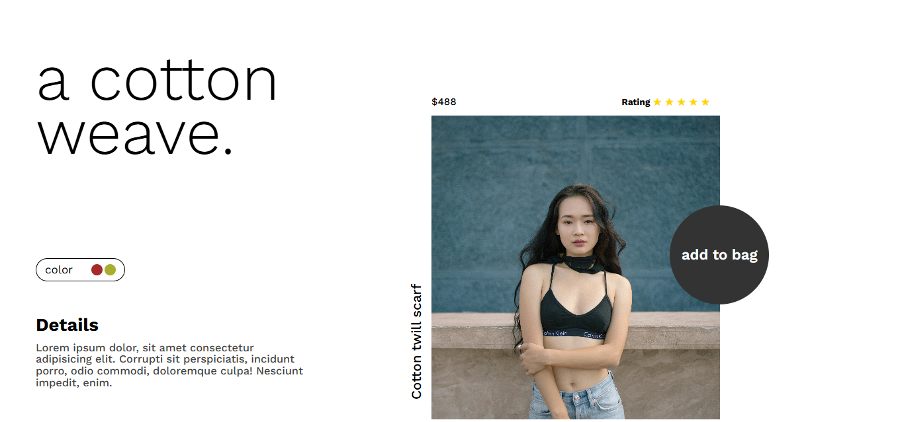
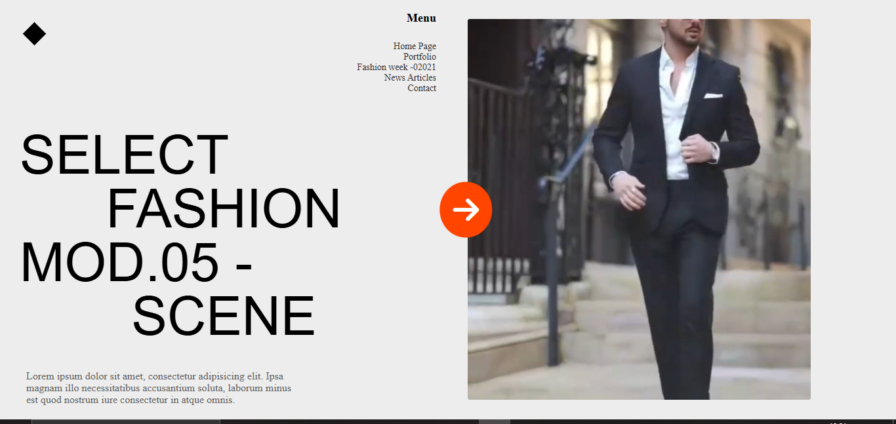
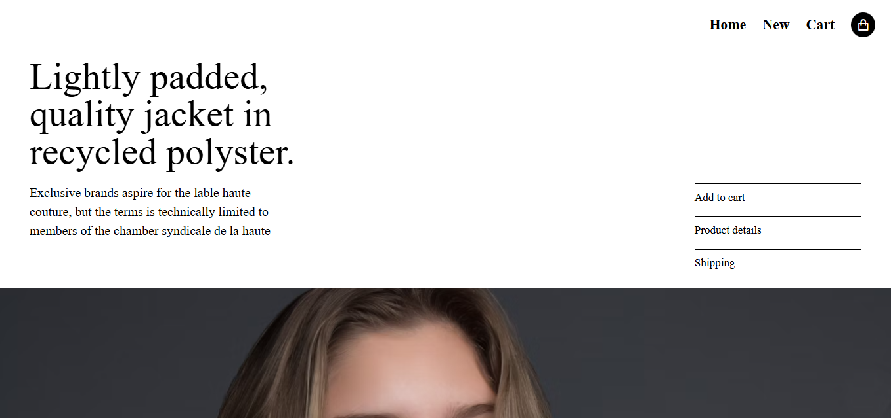
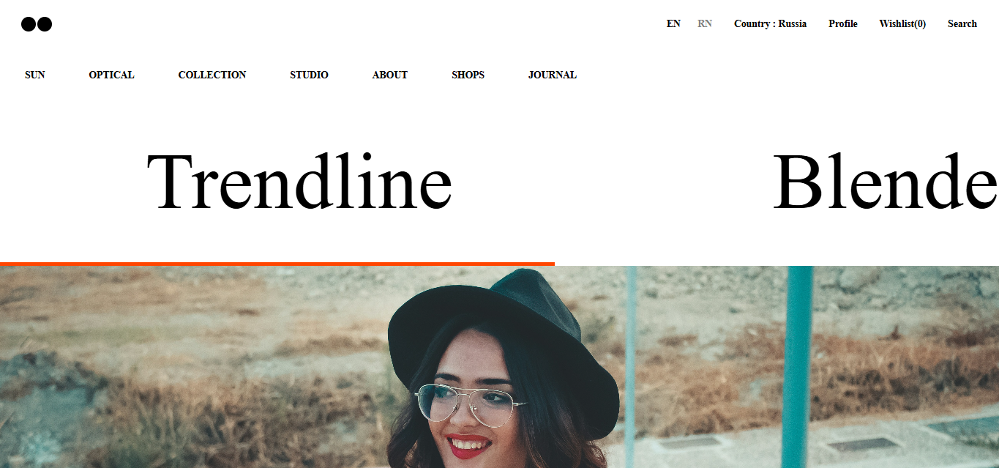
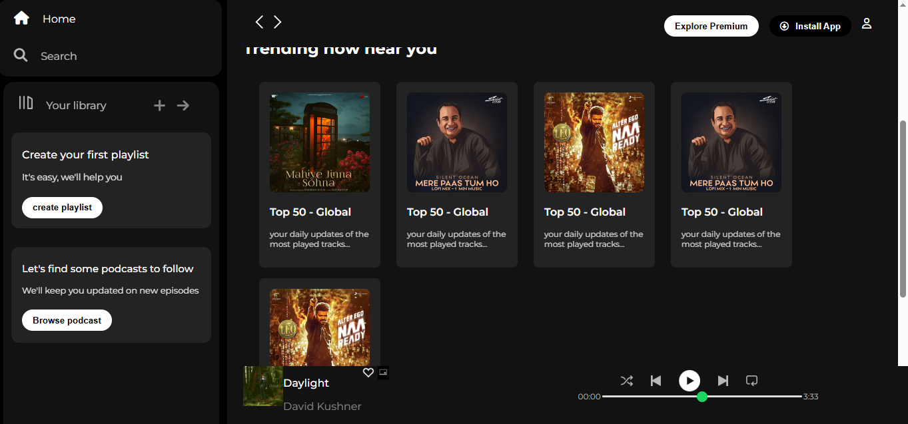

# 🎨 Mini Frontend Projects Collection

This repository contains a set of **mini frontend projects** built using **HTML**, **CSS**, and **Font Awesome** icons.  
Each project demonstrates different layout designs, styling concepts, and UI ideas for frontend development practice.

---

## 📁 Projects Included

| Project Name | Description |
|---------------|-------------|
| 🧵 **Cotton Cave** | A modern and stylish landing page design for a fashion brand. Focuses on typography, layout balance, and responsive design. |
## 🧵 Cotton Cave Preview


| 🧩 **Grid Project** | A clean layout experiment using **CSS Grid** to understand advanced grid techniques and responsive alignment. |
## 🧵 Grid Project Preview


| 🧥 **Jacket Shop** | A minimal eCommerce front page template for an online clothing store. Includes product cards, price sections, and hover effects. |
## 🧵 Cotton Cave Preview


| 💎 **Trendline** | A trendy homepage concept showcasing banners, navigation, and feature sections with smooth CSS transitions. |
## 🧵 Cotton Cave Preview


| 🎧 **Spotify Clone** | A simple frontend-only clone of Spotify’s music player UI using **Flexbox**, **CSS styling**, and **Font Awesome** for media icons. |
## 🧵 Cotton Cave Preview



---

## 🛠️ Built With

- **HTML5** – Structure and content  
- **CSS3** – Styling and layout  
- **Font Awesome** – Icons used across projects  

---

## 🚀 How to View Each Project

1. Clone this repository:
   ```bash
   git clone https://github.com/<your-username>/mini-frontend-projects.git

mini-frontend-projects/
│
├── cotton-cave/
│   ├── index.html
│   ├── cotton-cave.png
│   └── style.css
    
│
├── gridproject/
│   ├── index.html
│   ├── grid-project.png
│   └── style.css
│
├── jacketshop/
│   ├── index.html
│   ├── jacketshop.png
│   └── style.css
│
├── trendline/
│   ├── index.html
│   ├── trendline.png
│   └── style.css
│
└── spotify/
    ├── index.html
    ├── spotify-clone.png
    └── style.css


---

## 📘 Explanation

| Section | Purpose |
|----------|----------|
| **Title + Intro** | Gives overview of what’s inside the repo. |
| **Projects Table** | Highlights each project with emoji + description. |
| **Built With** | Mentions the main technologies used. |
| **How to View** | Guides users on how to clone and open projects. |
| **Folder Structure** | Shows how your files are organized. |
| **Contact** | Helps recruiters or collaborators reach you. |
| **License** | Makes it open source and professional. |

---

## 🔗 Live Demos
- [Cotton Cave](https://anuj-knirmal.github.io/mini-frontend-projects/cotton-cave/index.html)
- [Grid Project](https://anuj-knirmal.github.io/mini-frontend-projects/grid-project/index.html)
- [Jacket Shop](https://anuj-knirmal.github.io/mini-frontend-projects/jacket-shop/index.html)
- [Trendline](https://anuj-knirmal.github.io/mini-frontend-projects/trendline/index.html)
- [Spotify Clone](https://anuj-knirmal.github.io/mini-frontend-projects/spotify/index.html)

   
